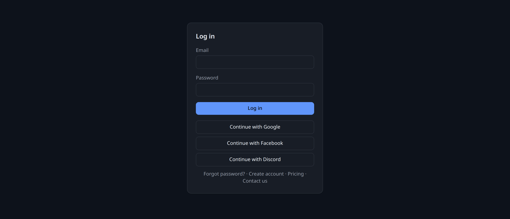
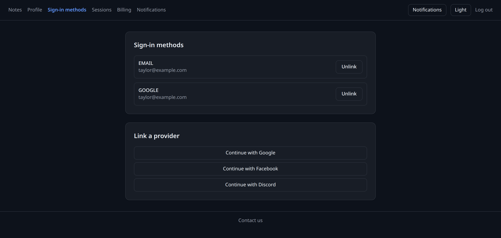
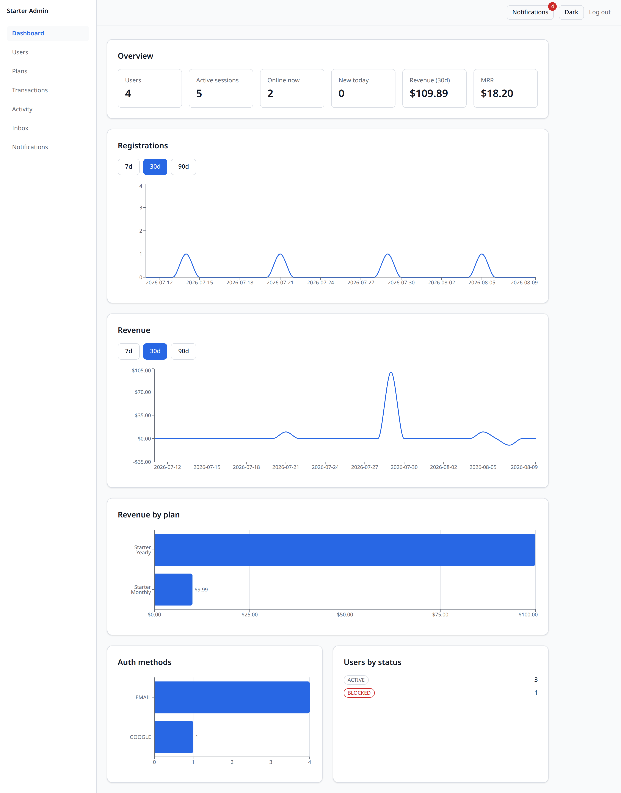
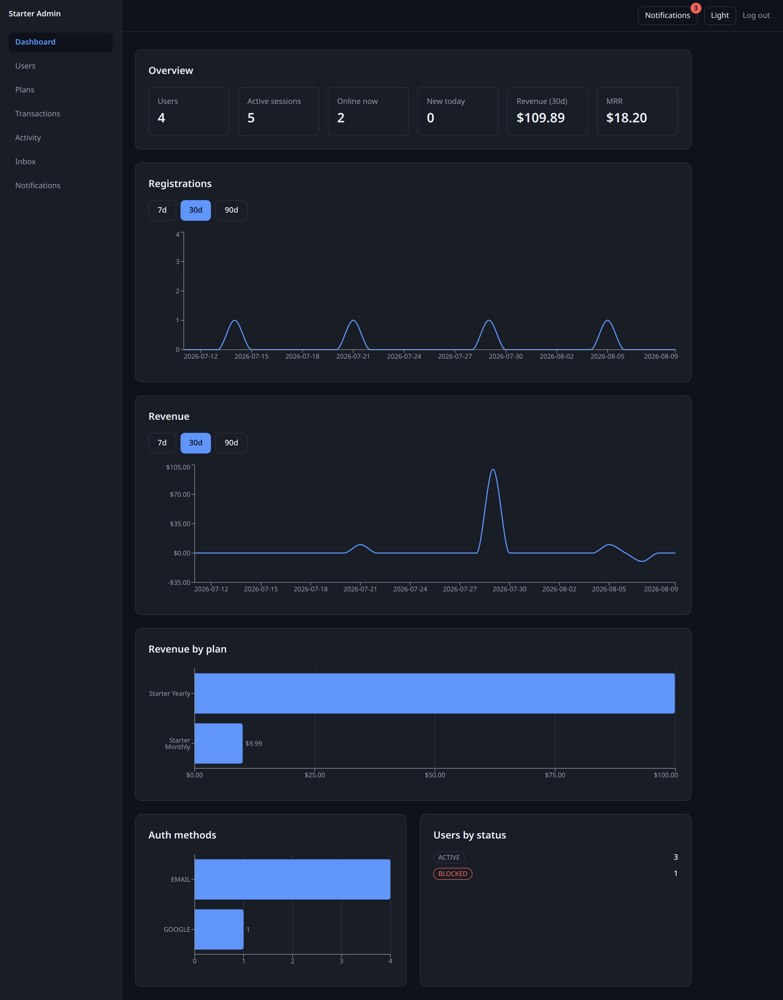
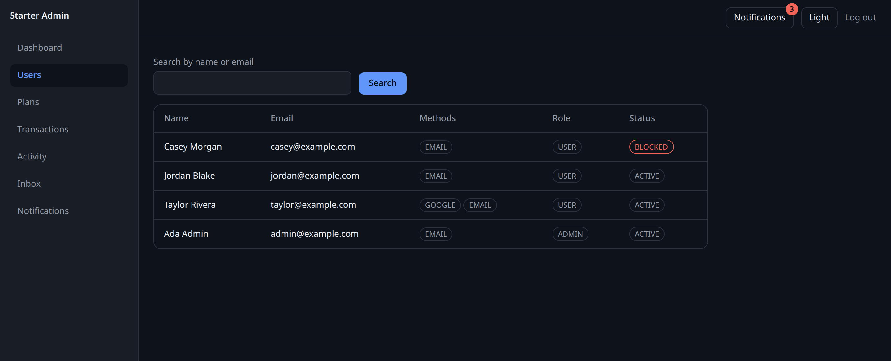
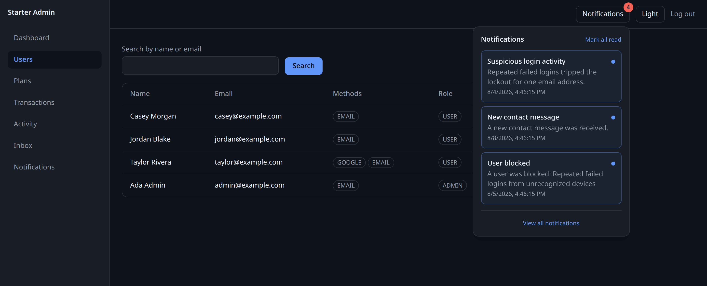

# nest-aws-starter

**A NestJS + React monorepo with auth, payments, notifications and an admin
console already built, tested and wired to AWS — clone it, rename it, and ship
your idea instead of your login form.**

Starters usually hand you a login form and leave. This one hands you the parts
that come after it: OAuth account linking, revocable sessions, Stripe
subscriptions whose webhooks drain through SQS, real-time notifications with a
per-user preference matrix, a role-gated admin console, and Terraform for the
whole AWS footprint. Every module ships unit *and* e2e tests — 46 e2e spec files
against real Postgres, Redis and LocalStack, plus 156 unit spec files across the
API and both frontends — and every optional module has a generated removal
recipe that CI proves the tree still builds without.

One command renames the whole tree to your project and, with `--drop-demo`,
takes the demo module out on the way. What is left is yours.

---

## What you get

### Auth and identity
Email/password with verification and reset · OAuth login **and** account linking
for Google, Facebook and Discord · refresh-token sessions you can list and
revoke · long-lived API keys · CASL permissions · login lockout, new-device
alerts and a suspicious-login trail. Tokens live in Redis, never in Postgres
([ADR 0003](docs/decisions/0003-tokens-in-redis-never-postgres.md)); nothing in
the tree sets a cookie ([ADR 0004](docs/decisions/0004-bearer-tokens-no-cookies.md)).

### Payments
Stripe-backed plans, checkout, subscriptions and the billing portal ·
transaction history · webhook processing drained through SQS so a slow handler
never times out Stripe's delivery · revenue and MRR statistics.

### Notifications
Domain events — a new-device login, a password change, a subscription activated,
a failed payment, a new contact message — become notifications that are
**persisted first**, then fanned out live over a Socket.IO gateway and by email.
A dead channel never rolls back the stored row. Users get a per-type,
per-channel preference matrix; the email channel is throttled to one message per
user, per type, per hour. Redis pub/sub keeps delivery correct across multiple
API instances.

### Admin operations
A separate role-gated React app: user management with block/unblock and
`login-as` impersonation, plans and transactions, an activity audit trail, a
contact-form inbox, and a notifications history filterable by type, audience and
read state — all server-side.

### AWS integration
S3 presigned uploads with optional CloudFront signed URLs · SQS queues · SNS
topics · SES mail · a Lambda invoker with an example function. All of it runs
offline against LocalStack and MinIO from `docker compose`, so you can build the
whole app before you own an AWS account.

### One-command deploy
Terraform for VPC, ECS Fargate, RDS, ElastiCache, ALB, CloudFront and S3, in two
cost profiles. `terraform apply` builds it; after that a push to `main` deploys
through GitHub OIDC — no AWS keys in the repository — with a migration gate that
refuses to swap the task definition if migrations fail. Rollback is one command.

### Modular by subtraction
The parts you don't want come out cleanly. Wherever an optional module is
referenced from code that stays, the reference carries a **fence marker** — a
`// <module:x>` comment that means *delete this line*, or a
`// <module:x>` … `// </module:x>` pair that means *delete this block*. That
makes every cross-reference machine-findable, so removal is a script rather than
a search. `scripts/subtraction-test.mjs` reads those markers to generate the 11
removal recipes in [`docs/removal/`](docs/removal/), and proves them by deleting
each module in a throwaway worktree and rebuilding what is left
([ADR 0008](docs/decisions/0008-modular-by-subtraction.md)).

CI runs the drift check — regenerate the recipes, fail on any diff — on **every
pull request**, so a recipe cannot fall out of step with the markers. The full
removal proof is far slower and runs nightly and on pushes to release branches.

---

## Screenshots

| | |
|---|---|
|  |  |
| **Log in.** Email and password, or Google, Facebook, Discord. | **Account linking.** One account, several identities — unlinking the last one is refused with `AUTH_LAST_METHOD`. |

Both apps ship light and dark themes. Same admin dashboard, same seeded demo
data, one toggle apart:

| | |
|---|---|
|  |  |
| **Admin dashboard — light.** | **Admin dashboard — dark.** |

| | |
|---|---|
|  |  |
| **User management.** Search, then open a user to block, unblock, impersonate or revoke sessions. | **The bell.** Admin-audience events arriving live over the socket. |

---

## Stack

Dependency policy is "newest stable minus thirty days"
([ADR 0009](docs/decisions/0009-newest-stable-minus-thirty-days.md)), so these
versions are current and move deliberately.

| Layer | Choice | Version |
|---|---|---|
| Runtime | Node (`.nvmrc`) · pnpm | 24 · 11.9.0 |
| API | NestJS on **Fastify** ([ADR 0002](docs/decisions/0002-fastify-over-express.md)), ESM-only ([ADR 0007](docs/decisions/0007-esm-only.md)), SWC | 11.1.27 · 5.8.5 |
| Database | Prisma (TypedSQL) · PostgreSQL · UUIDv7 keys ([ADR 0006](docs/decisions/0006-uuidv7-primary-keys.md)) | 7.8.0 · 18 |
| Cache & tokens | Redis via ioredis, single or cluster | 8 · 6.0.0 |
| Real-time | Socket.IO + `@socket.io/redis-adapter` | 4.8.3 · 8.3.0 |
| Auth | jose · argon2 · CASL | 6.2.3 · 0.44.0 · 7.0.0 |
| Payments | Stripe | 22.3.0 |
| AWS | SDK v3 — S3, SQS, SNS, SES, Lambda | 3.1079.0 |
| Frontends | React · Vite · Tailwind · Zustand · React Router | 19.2.7 · 8.1.3 · 4.3.2 · 5.0.14 · 8.3.0 |
| Contracts | `packages/shared` — zero runtime dependencies ([ADR 0001](docs/decisions/0001-contracts-over-implementations.md)) | — |
| Tooling | Turborepo · Biome · Vitest | 2.10.2 · 2.5.2 · 4.1.9 |
| Infrastructure | Terraform — ECS Fargate, RDS, ElastiCache, CloudFront | ~> 1.15 |

**Measured, on a laptop.** ~23.8k req/s on the health probe, ~2.0k on an
authenticated cursor-paginated list, ~1.3k on cached statistics. Those come from
a single API instance with local Postgres and Redis, a load generator competing
for the same cores, no network hop, and a CPU pinned at ~2.0 GHz. Treat them as
a floor for framework overhead and a regression tripwire — **not** as capacity
planning. Method, hardware and every caveat: [`docs/benchmarks.md`](docs/benchmarks.md).

---

## Quick start

You need **Docker** with the compose plugin, and **Node 24** — `.nvmrc` is
provided, so `nvm use` picks it up.

```bash
git clone git@github.com:ivpoov/nest-aws-starter.git
cd nest-aws-starter

nvm use                                    # Node 24
corepack enable                            # activates the pinned pnpm
pnpm install

cp apps/api/.env.example apps/api/.env     # works as-is against the compose stack

docker compose up -d --wait                # Postgres, Redis, LocalStack, MinIO
pnpm --dir apps/api run db:migrate         # apply the 17 committed migrations
pnpm run build                             # generates the Prisma client + shared contracts
pnpm --dir apps/api run db:seed            # demo accounts and data

pnpm --dir apps/api run start:dev          # API on http://localhost:3000
```

Run `pnpm run build` **after** `db:migrate` and before anything else: Prisma
TypedSQL type-checks its queries against a live, migrated database, and both the
seed and the API import `packages/shared`, which does not exist until it is
built.

The API answers on `http://localhost:3000` — Swagger UI at
[`/docs`](http://localhost:3000/docs), probes at `/api/v1/health/live` and
`/api/v1/health/ready`.

Then, in two more terminals:

```bash
pnpm --dir apps/web run dev      # user app  → http://localhost:5173
pnpm --dir apps/admin run dev    # admin app → http://localhost:5174
```

### Sign in

The seed creates four demo accounts. **Development only** — the seed refuses to
run with `NODE_ENV=production`, because these passwords are printed in a public
README.

| Account | Password | What it shows |
|---|---|---|
| `admin@example.com` | `DemoAdmin123!` | Admin — the whole admin app |
| `taylor@example.com` | `DemoUser123!` | User with a linked Google identity |
| `jordan@example.com` | `DemoUser123!` | User with email and password only |
| `casey@example.com` | `DemoUser123!` | Blocked — login is refused with `USER_BLOCKED` |

Seeding is idempotent: every row has a deterministic id and is upserted, so
re-running it refreshes the demo data instead of duplicating it.

---

## Testing

```bash
pnpm run test        # unit tests, no infrastructure needed
pnpm run test:e2e    # e2e against the compose stack (start it first)
pnpm exec biome ci . # lint + format check
```

CI runs lint, build, both suites and a dependency audit on every pull request.

Host ports are shifted off the standard ones so the stack coexists with services
you already run — Postgres `5433`, Redis `6390`, LocalStack `4567`, MinIO
`9010`/`9011` — and each is overridable from a root `.env` (see
[`.env.example`](.env.example)). Two optional compose profiles:

```bash
docker compose --profile init up minio-init   # create the S3 bucket once
docker compose --profile cluster up -d        # 4-node Redis cluster on 7000-7003
```

If `test:e2e` aborts with `E2E PREFLIGHT: LocalStack is up but still missing
...`, LocalStack was started before `docker/localstack/init-aws.sh` provisioned
it — a stale container reused by `docker compose up -d`. One line fixes it:

```bash
docker compose up -d --force-recreate localstack
```

Building the production API image and running it against this same stack is
covered in [`docs/guides/container.md`](docs/guides/container.md).

---

## Repository map

```
apps/api/            # NestJS API — controller → service → repository, 25 modules
apps/web/            # user app — Vite + React + Tailwind + Zustand
apps/admin/          # admin panel — same stack, role-gated
apps/docs/           # Astro + Starlight site that publishes docs/ — no prose of its own
packages/shared/     # wire contracts shared by the API and both frontends
infra/terraform/     # the AWS footprint, in two cost profiles
lambdas/example/     # echo Lambda demonstrating the invoker pattern
docker/              # compose init scripts
scripts/             # bootstrap rename, subtraction test, benchmark, release tooling
docs/                # architecture, decisions, conventions, guides, removal recipes
```

---

## Make it yours

A clone still carries the original name in roughly 550 places — every
`package.json`, every `@nest-aws-starter/shared` import, the compose project, the
database, the MinIO bucket, the SQS queues, the SNS topic, the Swagger title,
Terraform's `project_name`, the image tag, the `CODEOWNERS` handle. That is an
afternoon of careful grep. It is also one command:

```bash
pnpm bootstrap --name my-app --scope @my-app --author "Jane Doe" --repo owner/repo
```

It rewrites every file git tracks, regenerates `pnpm-lock.yaml`, and re-runs
`biome check --write` — a shorter scope changes line widths and import order, so
a renamed clone that skipped the format pass fails `pnpm run lint`. Add
`--dry-run` first to see the list before anything is written; it refuses to run
on a dirty tree unless you pass `--force`.

| Flag | What it does |
|---|---|
| `--name` | Project name. Required, lowercase kebab-case. |
| `--scope` | Workspace scope for `packages/shared` and friends. Defaults to `@<name>`. |
| `--author` | `LICENSE` copyright holder, plus `author` in the root `package.json`. |
| `--repo` | `owner/repo` for the absolute GitHub URLs. Defaults to your clone's `origin`. |
| `--db` | Postgres database name. Defaults to `<name>` with dashes as underscores — Terraform's `database_name` rejects dashes. |
| `--drop-demo` | Also delete the `note` demo module — and this script. |
| `--dry-run` | Report, write nothing. |

**Pass `--repo`.** GitHub issue forms do not resolve relative links, so
`SECURITY.md` and `.github/ISSUE_TEMPLATE/` carry absolute `github.com` URLs.
Left alone, your fork's "report a security vulnerability" link points at *this*
repository's inbox rather than yours, silently. Its owner half also becomes the
handle in `.github/CODEOWNERS`.

`--drop-demo` does not reimplement deletion: it calls straight into
`scripts/subtraction-test.mjs`, removing the `note` module's paths and its
`// <module:note>` fences with the same code the nightly proof runs. It then
regenerates `docs/removal/` and deletes itself, because a rename script has one
job and you have now done it.

Two things it deliberately leaves alone: your untracked `.env` files (re-copy
`apps/api/.env.example` afterwards — its `DATABASE_URL` carries the database
name) and any `version` field.

---

## Deploy to AWS

[`infra/terraform`](infra/terraform/) describes the whole footprint — VPC, ECS
Fargate, RDS, ElastiCache, ALB, CloudFront, S3, SSM parameters, alarms and a
budget — behind one variable:

| `cost_profile` | What it is | Rough cost |
|---|---|---|
| `demo` | The cheapest thing that runs end to end, and disposable with it. | ~$15–25/month, dominated by RDS, the ALB and one Fargate task |
| `production` | Multi-AZ, autoscaled, backed up, alarmed. | Substantially more — NAT egress alone is ~$32/month per gateway, one per AZ |

The no-NAT trade-off the `demo` profile makes is written up in
[ADR 0010](docs/decisions/0010-two-cost-profiles-and-the-no-nat-trade-off.md).

Bring it up once, from a machine with AWS credentials:

```bash
cd infra/terraform/bootstrap        # S3 state bucket, native locking, no DynamoDB
cp terraform.tfvars.example terraform.tfvars   # edit
terraform init && terraform apply

cd ..                               # the real stack
cp backend.hcl.example backend.hcl             # edit
cp terraform.tfvars.example terraform.tfvars   # edit — set github_repository
terraform init -backend-config=backend.hcl && terraform apply
```

Then `terraform output github_actions_setup` prints the three `gh` commands that
wire up the deploy — one role ARN and two variables. There is no AWS access key
anywhere: `.github/workflows/deploy.yml` assumes a role through GitHub OIDC,
scoped by a trust policy to this repository and `refs/heads/main`.

After that, **a push to `main` is the deploy.** The workflow builds and pushes
the image tagged with the commit SHA, runs migrations as a one-off ECS task and
stops dead if they fail, swaps the task definition, waits for the service to
stabilise, verifies it did not silently roll back, smoke-tests `/health/ready`
through the ALB, then publishes both frontends to S3 and invalidates
CloudFront. Rolling back is one command:

```bash
gh workflow run deploy.yml -f sha=<earlier-commit-sha>
```

> **Honest status.** This Terraform is designed and validated — `fmt`, `validate`
> and `tflint` run in CI — but it has **never been applied against a real AWS
> account**. Treat it as a reviewed starting point, not a proven deployment.
> Read [`docs/guides/production.md`](docs/guides/production.md) before you apply
> it; it covers what `production` actually flips, backup and restore, secret
> rotation, and an explicit list of what this starter deliberately does not do.

---

## Documentation

| | |
|---|---|
| [`docs/architecture.md`](docs/architecture.md) | Request lifecycle, event map, caching tiers, the AWS surface. **Start here.** |
| [`docs/decisions/`](docs/decisions/) | 10 ADRs — why each choice was made, and what it cost. |
| [`docs/conventions/`](docs/conventions/) | The law of this repository: [backend](docs/conventions/backend.md), [frontend](docs/conventions/frontend.md), [shared contracts](docs/conventions/shared-contracts.md). |
| [`docs/guides/adding-a-module.md`](docs/guides/adding-a-module.md) | One feature module built file by file — schema, migration, contract, repository, service, DTOs, permissions, controller, tests, fences. |
| [`docs/guides/container.md`](docs/guides/container.md) | The API image, its layer cache, and running it against the compose stack. |
| [`infra/terraform/README.md`](infra/terraform/README.md) | Every Terraform variable, both cost profiles, and the OIDC wiring end to end. |
| [`docs/guides/production.md`](docs/guides/production.md) | Going live: cost profiles, backups, secrets, incidents, and the gaps. |
| [`docs/removal/`](docs/removal/) | Generated per-module removal recipes, proven by CI. |
| [`docs/benchmarks.md`](docs/benchmarks.md) | What was measured, on what, and why you should not quote it as capacity. |
| [`CONTRIBUTING.md`](CONTRIBUTING.md) · [`SECURITY.md`](SECURITY.md) | How work flows through branches and PRs · how to report a vulnerability. |
| [`CODE_OF_CONDUCT.md`](CODE_OF_CONDUCT.md) | The standard everyone taking part is held to, and where to report a breach. |

Every page above is also published as a site, built from these same files by
[`apps/docs/`](apps/docs/) — see [The documentation site](CONTRIBUTING.md#the-documentation-site)
if you want to build it locally.

The `note` module is the living reference implementation of the backend
conventions — read it alongside [`docs/conventions/backend.md`](docs/conventions/backend.md),
then delete it with `pnpm bootstrap --drop-demo`.

---

## License

MIT — see [`LICENSE`](LICENSE). Clone it, change it, ship it; keep the copyright
notice.
