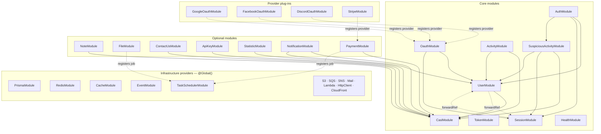
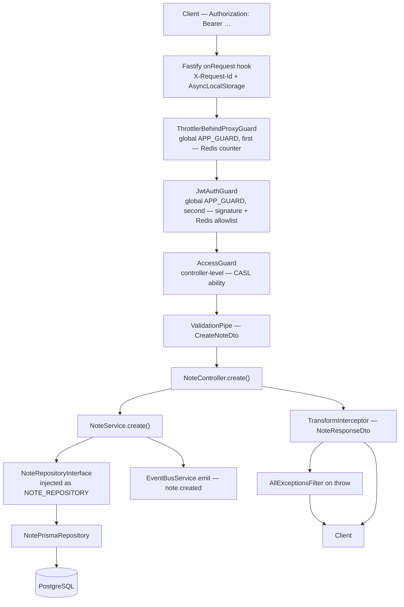

# Architecture

How this repository is put together, and where to look when you need to change something.

Everything below is a claim about code that exists in this tree. File paths are relative to
the repository root, and where a table could drift from the code it is generated by a command
that is printed next to it.

Related reading:

- [`docs/conventions/backend.md`](./conventions/backend.md) — the binding rules for backend
  code. Read it before writing any.
- [`docs/decisions/`](./decisions/) — one page per architectural decision, including the
  costs.
- [`docs/removal/`](./removal/) — generated recipes for deleting optional modules.
- [`docs/guides/adding-a-module.md`](./guides/adding-a-module.md) — a worked, end-to-end
  walkthrough building one feature module against every convention.
- [`docs/guides/container.md`](./guides/container.md) — how the API image is built and run.

---

## 1. The shape of the system

Three deployable artifacts and one shared contract package:

| Path | What it is |
|---|---|
| `apps/api` | NestJS application on Fastify. The only thing that talks to PostgreSQL or Redis. |
| `apps/web` | End-user SPA — Vite, React, Tailwind, Zustand. |
| `apps/admin` | Admin console — same stack, role-gated. |
| `packages/shared` | Wire contracts (enums, request/response interfaces) imported by all three. |
| `lambdas/example` | An echo Lambda demonstrating the invoker pattern. |

Inside `apps/api`, everything is a NestJS module under `apps/api/src/modules/`. Modules come
in three flavours:

- **Infrastructure providers** (`modules/common/providers/*`) — Prisma, Redis, the cache
  facade, S3, SQS, SNS, mail, Lambda, HTTP client, CloudFront. Most are `@Global()`, and most
  have a disabled fallback implementation so the app boots without the corresponding AWS
  service.
- **Core modules** — user, token, session, auth, oauth, activity, suspicious-activity, casl,
  health, event, task-scheduler. Removing any of these is not a supported operation.
- **Optional modules** — note, file, contact-us, api-key, statistic, notification, payment,
  the three OAuth providers, Stripe, CloudFront. Each is fenced with `// <module:x>` markers
  and has a generated removal recipe. See
  [ADR 8](./decisions/0008-modular-by-subtraction.md).

### Module dependency graph

Edges are *declared* `imports:` in a `*.module.ts` (solid) or runtime self-registration into
a registry owned by another module (dashed). `@Global()` modules are resolvable everywhere
without an import and are drawn as a layer rather than with an edge to every consumer.



Two things this graph is deliberately missing, because they are not module imports:

- **The event bus.** Most cross-module coupling is not an import at all — it is a domain
  event. `ActivityModule` records an audit row for eighteen different events without
  importing a single feature module. See §3.
- **`CaslModule.forFeature()`.** The `--> Casl` edges are permission registrations, not
  service dependencies: each feature module hands its permission definitions to the global
  ability factory at boot.

---

## 2. The request lifecycle

Trace of `POST /api/v1/notes`, which is the reference implementation of every rule in
`docs/conventions/backend.md`.



### 2.1 Fastify

`apps/api/src/main.ts` builds the adapter before Nest exists:

- `.env` is loaded **before** the adapter is constructed, because `trustProxy` has to be
  decided at adapter-construction time and `ConfigModule` only runs once `AppModule`
  resolves.
- `new FastifyAdapter({ trustProxy: process.env.TRUST_PROXY === 'true' })`.
- A raw Fastify `onRequest` hook assigns or echoes `X-Request-Id` and opens an
  `AsyncLocalStorage` scope (`RequestContextService.run`) so every log line for this request
  carries the id — including logs emitted from code that has no request object in scope.
- The app is created with `{ bufferLogs: true, rawBody: true }`. `rawBody` is application-wide
  because it is a bootstrap option, not a per-route one; only the Stripe webhook controller
  reads it, and it needs the exact bytes to verify a signature.
- The WebSocket adapter is installed **before** `listen()`, so the notification gateway binds
  against the configured adapter (Redis-backed, or a detached no-op server when
  `WEBSOCKET_ENABLED` is false).

`configureApp()` (`modules/common/helpers/configure-app.helper.ts`) then applies, in order:
`@fastify/helmet` security headers, CORS (exact-match allowlist, `credentials: false` —
[ADR 4](./decisions/0004-bearer-tokens-no-cookies.md)), the global prefix (`api`), URI
versioning (default `v1`), a global `ValidationPipe({ whitelist: true, transform: true })`,
and `AllExceptionsFilter`.

### 2.2 Guards

Two guards are global, and the order in `app.module.ts` is load-bearing — the comment says
so: *"Order matters: throttling runs before authentication."*

1. **`ThrottlerBehindProxyGuard`** — 100 requests per 60 s by default, with per-route
   overrides via `@Throttle(...)` (notes creation is 30/min). Counters live in Redis
   (`ThrottlerRedisStorageService`), so the limit is global across instances rather than
   per-container. The tracker is `X-Forwarded-For`'s first entry when `TRUST_PROXY` is on,
   the socket IP otherwise.
2. **`JwtAuthGuard`** — skipped entirely for handlers marked `@Public()`. Otherwise it
   extracts the `Bearer` token, and `TokenService.verifyAccessToken` validates *both* the
   signature and the Redis allowlist key. A structurally valid JWT whose allowlist key was
   deleted is rejected, which is what makes revocation instant
   ([ADR 3](./decisions/0003-tokens-in-redis-never-postgres.md)). On success it sets
   `request.user` and fires a best-effort, non-awaited presence touch.

Then per-controller guards, applied with `@UseGuards(...)`:

3. **`AccessGuard`** (CASL) — two responsibilities. Unconditionally, it rejects any request
   on an `@AdminScope()` controller made by an impersonating session (`user.actAsBy`), so no
   admin route can be reached through `login-as` even if a future route forgets its ability
   decorator. Then, if the handler carries `@UseAbility(action, subject)`, it builds the
   user's ability from the registered permission sets and checks it.
4. **`ApiKeyGuard`** / **`RequiresSubscriptionGuard`** exist for routes authenticated by a
   long-lived API key and for plan-gated routes respectively.

### 2.3 Controller

`NoteController` is HTTP and nothing else: routing, Swagger metadata, DTO binding, guard
declaration and response serialization. It reads the caller from `@CurrentUserId()`, validates
path ids with `ParseUUIDPipe`, and declares its response shape with `@Serialize(NoteResponseDto)`
— which is a thin wrapper over `TransformInterceptor`, itself a `plainToInstance(...,
{ excludeExtraneousValues: true })`. A field that is not `@Expose()`d on the response DTO
cannot leak, regardless of what the service returned.

### 2.4 Service

`NoteService` holds the business logic and nothing else. It has no HTTP vocabulary and no
database vocabulary. It:

- injects `NoteRepositoryInterface` under the `NOTE_REPOSITORY` symbol,
- throws domain errors (`NotFoundError(NOTE_NOT_FOUND)`, `ForbiddenError(NOTE_ACCESS_DENIED)`)
  that carry a stable string code and no HTTP status,
- computes the next cursor from the page it just fetched
  ([ADR 5](./decisions/0005-cursor-pagination-by-default.md)),
- emits domain events through `EventBusService`.

### 2.5 Repository contract → Prisma

The contract is a plain interface with intention-revealing methods:

```typescript
export interface NoteRepositoryInterface {
  create(data: CreateNoteDataInterface): Promise<NoteInterface>;
  findById(id: string): Promise<NoteInterface | null>;
  findManyAfter(userId: string, pagination: CursorPaginationInterface): Promise<NoteInterface[]>;
  update(id: string, data: UpdateNoteDataType): Promise<NoteInterface | null>;
  deleteById(id: string): Promise<boolean>;
}
```

`NotePrismaRepository` is the only file in the module allowed to import the generated Prisma
client. It maps rows to domain interfaces in a private `toDomain()`, translates Prisma's
`P2025` ("record not found") into a domain-neutral `null`/`false` so writes stay atomic
without a pre-check race, and lets everything else propagate. Nothing above it knows Prisma
exists — see [ADR 1](./decisions/0001-contracts-over-implementations.md).

The Prisma client is generated into `apps/api/src/generated/prisma` (not `node_modules`) and
imported through the `@generated/*` path alias.

### 2.6 Errors out

`AllExceptionsFilter` is the single place an exception becomes an HTTP response.

- A domain `AppError` maps through `HTTP_STATUS_BY_ERROR_CATEGORY` to a status, and its
  `{ code, details }` go on the wire unchanged.
- A Nest `HttpException` (router 404, `ValidationPipe` 400, guard rejections) keeps its status
  and gets a generic code derived from the reason phrase.
- Anything else is logged with its stack and returned as `INTERNAL_SERVER_ERROR`. The
  original message never reaches the client.

Every response body carries `timestamp` and `path`.

### 2.7 Entry points that are not HTTP

Three other things drive the same services:

- **WebSocket** — `NotificationGateway` (Socket.IO). The handshake carries the access token in
  `auth.token` and is validated by the same `TokenService.verifyAccessToken`. A shared
  heartbeat sweep re-validates all tracked sockets on one interval rather than one timer per
  socket. CORS origins are injected by the adapter at bootstrap, never read in the decorator.
- **SQS long-poll** — `PaymentWebhookConsumerService` starts a poll loop on
  `OnApplicationBootstrap` and drains it on shutdown. Idempotency is layered: a status
  short-circuit on the `webhook_events` row plus a per-event Redis lock. Every step is also a
  public method so e2e tests can call it directly instead of racing the loop.
- **Scheduled jobs** — `TaskSchedulerModule` owns a registry and a lock-guarded runner;
  feature modules self-register a job at boot (`OrphanFileSweepJob`). The Redis lock is what
  keeps a job from running once per container.

---

## 3. The domain event bus

`EventBusService` is a thin wrapper over `@nestjs/event-emitter`; `@OnDomainEvent` is an alias
for `@OnEvent`. Both live in `apps/api/src/modules/event/`, and the indirection is the point:
feature code depends on this repository's names, not on the library's.

Two properties worth knowing before you use it:

- **In-process only.** Handlers run in the same Node process as the emitter. This is an
  in-memory emitter, not a distributed bus — an event emitted on instance A is not seen by
  instance B.
- **Fire-and-forget.** `emit()` returns `void` and is not awaited by the caller. A handler
  that throws does not fail the request that emitted the event, and there is no retry and no
  dead-letter. `ActivityListener` wraps every handler in a `safeRecord()` that swallows and
  logs, precisely because a failed audit write must not become a failed login.

Consequently: events are for *reactions* (audit rows, notifications, counters), never for
work that must not be lost. Payment webhooks go through SQS, not through this bus.

### 3.1 The map

**This table is generated, not hand-maintained.** Regenerate it after any change to an emit
site or a handler by running the following from the repository root and pasting the output
back into this section:

```bash
cd apps/api/src

{
  # emit sites: every eventBus.emit(...) call, plus one line of context so a
  # constant that sits on the line after `emit(` is still seen.
  grep -rE --include='*.ts' --exclude='*.spec.ts' -A1 'eventBus\.emit\(' .
  # subscribers: every @OnDomainEvent(...) handler.
  grep -rE --include='*.ts' --exclude='*.spec.ts' '@OnDomainEvent\(' .
} \
  | sed -E 's#^\./modules/([^/]+)/[^:]*\.ts[:-]#\1 #' \
  | awk '{
      mod = $1
      kind = ($0 ~ /OnDomainEvent/) ? "sub" : "emit"
      while (match($0, /[A-Z0-9_]+_EVENT/)) {
        print substr($0, RSTART, RLENGTH) "\t" kind "\t" mod
        $0 = substr($0, RSTART + RLENGTH)
      }
    }' \
  | sort -u \
  | awk -F'\t' '
      $2 == "emit" { e[$1] = e[$1] (e[$1] ? ", " : "") $3 }
      $2 == "sub"  { s[$1] = s[$1] (s[$1] ? ", " : "") $3 }
      END { for (k in e) printf "| `%s` | %s | %s |\n", k, e[k], (s[k] ? s[k] : "_none_") }
    ' \
  | sort
```

The `-A1` context line matters: `UserService` picks the event name with a ternary on the line
after `emit(`, so a single-line grep would miss `USER_UNBLOCKED_EVENT` entirely. The event
name string each constant resolves to is in
`apps/api/src/modules/event/constants/event-names.constants.ts`.

| Event constant | Emitted by | Subscribed by |
|---|---|---|
| `ADMIN_LOGIN_AS_EVENT` | user | activity |
| `API_KEY_CREATED_EVENT` | api-key | activity |
| `API_KEY_REVOKED_EVENT` | api-key | activity |
| `AUTH_LOGIN_EVENT` | auth | activity, suspicious-activity |
| `AUTH_LOGIN_FAILED_EVENT` | auth | activity, suspicious-activity |
| `AUTH_LOGOUT_EVENT` | auth | activity |
| `AUTH_METHOD_LINKED_EVENT` | auth, oauth | activity, notification |
| `AUTH_METHOD_UNLINKED_EVENT` | auth | activity, notification |
| `AUTH_NEW_DEVICE_EVENT` | auth | activity, notification, suspicious-activity |
| `AUTH_PASSWORD_CHANGED_EVENT` | auth | activity, notification |
| `AUTH_SUSPICIOUS_LOGIN_EVENT` | suspicious-activity | activity, notification |
| `CONTACT_RECEIVED_EVENT` | contact-us | activity, notification |
| `FILE_UPLOADED_EVENT` | file | activity |
| `NOTE_CREATED_EVENT` | note | _none_ |
| `SUBSCRIPTION_ACTIVATED_EVENT` | payment | activity, notification |
| `SUBSCRIPTION_CANCELED_EVENT` | payment | activity, notification |
| `SUBSCRIPTION_EXPIRED_EVENT` | payment | activity, notification |
| `SUBSCRIPTION_PAST_DUE_EVENT` | payment | activity, notification |
| `SUBSCRIPTION_RENEWED_EVENT` | payment | activity, notification |
| `USER_BLOCKED_EVENT` | user | activity, notification |
| `USER_OAUTH_REGISTERED_EVENT` | oauth | activity, user |
| `USER_REGISTERED_EVENT` | auth | activity |
| `USER_UNBLOCKED_EVENT` | user | activity |
| `WEBHOOK_FAILED_EVENT` | payment | notification |

Reading the table:

- **`activity` subscribes to almost everything.** That is the design: feature services never
  call `ActivityService`, they emit, and `ActivityListener` is the single place an event
  becomes an audit row.
- **`notification` is the other broad subscriber.** `NotificationDispatcherService` persists a
  notification first, then fans out over WebSocket and (per user preference) email.
- **`NOTE_CREATED_EVENT` has no subscribers.** It is not dead code by accident — the `note`
  module is the reference implementation, and it demonstrates the emit side of the pattern
  for a feature that has nothing to react to it.
- **`USER_OAUTH_REGISTERED_EVENT` is consumed by `user` itself** (`OauthAvatarListener`),
  which is how an OAuth profile picture gets fetched without `OauthModule` depending on
  avatar logic.

---

## 4. Caching tiers

There are four distinct caches in the system and they are not interchangeable.

### 4.1 The application cache facade (L1 memory + L2 Redis)

`CacheService` (`modules/common/providers/cache/`) is a facade over an ordered list of stores
that all implement the same four-method contract:

```typescript
export interface CacheStoreInterface {
  get<T>(key: string): Promise<T | null>;
  set<T>(key: string, value: T, ttlMs: number): Promise<void>;
  delete(key: string): Promise<void>;
  deleteByPrefix(prefix: string): Promise<void>;
}
```

**Composition is per consumer, not global.** There is no "caching enabled" flag. Each call
site asks `CacheFactoryService.create()` for the cache it wants:

| Consumer | Composition | Key | TTL |
|---|---|---|---|
| `NotificationPreferenceService` | memory + Redis | `notification:preference:{userId}` | 60 s |
| `StatisticCacheService` (overview) | Redis only | `statistic:overview` | 60 s |
| `StatisticCacheService` (series) | Redis only | `statistic:series:{metric}:{days}` | 300 s |

The statistic cache's comment states why it opts out of L1: the admin dashboard is low-QPS,
so a per-instance memory tier would add staleness variance for no throughput win.

Behaviour that will bite you if you do not know it, all documented in the source:

- `wrap(key, ttlMs, factory)` reads down the tiers, backfills the tiers it missed, and
  single-flights concurrent misses per key **in-process**. Two containers can still run the
  factory concurrently.
- **`null` is indistinguishable from a miss.** A factory that legitimately returns `null` runs
  on every call. Wrap it in an object.
- **A lower-tier hit backfills upper tiers with the full TTL again**, so the worst-case
  staleness is 2× the L1 TTL — 120 s for notification preferences.
- `MemoryCacheStore` is a bounded LRU (1000 entries by default). An unbounded in-process cache
  is a memory leak with extra steps.

### 4.2 Cross-instance invalidation

The memory tier is per-instance, so deleting a key locally is not enough.
`CacheInvalidationService` publishes every `delete`/`deleteByPrefix` on the Redis channel
`cache:invalidation`, tagged with a per-process `senderId` so a publisher ignores its own
message. It opens a **second** Redis connection for the subscription, because subscribing puts
a connection into subscriber mode and the shared client is still doing normal work.

Note the asymmetry: invalidation is broadcast on **delete**, not on **set**. Writes do not
propagate; only removals do.

### 4.3 Redis as a datastore, not a cache

Much of what lives in Redis is not cached data at all and must not be treated as evictable:
the token allowlist, one-time email/reset tokens, OAuth state and exchange codes, throttle
counters, login-lockout counters, distributed locks (`lock:` prefix,
`RedisLockService`), the online-user presence set, and the Socket.IO adapter's pub/sub.
See [ADR 3](./decisions/0003-tokens-in-redis-never-postgres.md) for what that implies
operationally.

### 4.4 The edge (CloudFront)

The SPA distributions cache `/assets/*` with the AWS managed `CachingOptimized` policy —
those filenames are content-hashed by Vite and safe to cache indefinitely — and use
`CachingDisabled` for everything else, so `index.html` is always fresh. `403`/`404` are
rewritten to `/index.html` with status 200 for SPA routing.

**Gap worth knowing:** `docs/conventions/backend.md` §10b says HTTP responses opt into caching
via explicit `Cache-Control` headers and that "the API defaults to `no-store` on authenticated
endpoints". No `Cache-Control` header is set anywhere in `apps/api` today. The convention is
aspirational on this point; API responses carry whatever Fastify defaults to.

---

## 5. The AWS surface

The Terraform in `infra/terraform/` is a root stack composed of seven modules
(`network`, `compute`, `data`, `services`, `edge`, `observability`, `cicd`) plus a separate
`bootstrap/` stack that creates the state bucket. All of it is driven by one variable,
`cost_profile` — see
[ADR 10](./decisions/0010-two-cost-profiles-and-the-no-nat-trade-off.md) for the full
profile diff and the trade-offs.

What actually gets created:

**Network.** One VPC (default `10.0.0.0/16`, `/24` subnets), an internet gateway, public
subnets in every AZ, private subnets and per-AZ route tables **only on the production
profile**, and an **S3 gateway endpoint on both profiles** (it is free, and ECR layers live in
S3). The VPC's default security group is explicitly stripped of all rules. Interface VPC
endpoints and NAT gateways are both opt-in and both default to none. Security groups form a
strict chain — internet → ALB → API → {database, cache} — using security-group references,
never CIDRs; the database and cache groups have *no* egress rules at all.

**Compute.** An ECS cluster with both `FARGATE` and `FARGATE_SPOT` capacity providers, an ECR
repository (`api`) with scan-on-push and a lifecycle policy, an ECS service behind an
internet-facing ALB, and a **separate migrations task definition** that Terraform declares but
does not run — the deploy workflow runs it and gates on its exit code before updating the
service. The target group health-checks `/api/v1/health/ready`, uses
`least_outstanding_requests`, and enables `lb_cookie` stickiness for 24 h because Socket.IO's
polling handshake needs it. Deployment circuit breaker with rollback is on. CPU-target
autoscaling (2–6 tasks) exists on the production profile only.

**Data.** A single-instance PostgreSQL `aws_db_instance` (not Aurora), gp3, encrypted,
`publicly_accessible = false`, with `rds.force_ssl = 1` and slow-query logging above 1 s. The
password is a `random_password` that is never an output — it only ever appears inside the
generated `DATABASE_URL`. Redis is either an ElastiCache replication group (production) or a
`redis:8-alpine` **sidecar container in the same task** (demo). Configuration and secrets go
to **SSM Parameter Store**, not Secrets Manager: three Terraform-owned `SecureString`
parameters (`AUTH_JWT_SECRET`, `DATABASE_URL`, `REDIS_URL`) plus eight `REPLACE_ME`
placeholders for OAuth and Stripe credentials, all with `ignore_changes = [value]` so
Terraform never clobbers what you paste in.

**Application services.** An uploads S3 bucket (versioned, SSE-S3, public access blocked,
CORS and lifecycle configured), an SQS queue for payment webhooks with a dead-letter queue
(`maxReceiveCount = 5`, matched to the app's `MAX_WEBHOOK_ATTEMPTS`), an SNS topic for
application notifications, and optional SES domain identity + DKIM. Two IAM roles — task and
task-execution — both with confused-deputy conditions on their trust policy, and both scoped
tightly: the execution role deliberately lacks `logs:CreateLogGroup` so the awslogs driver
cannot create a log group without a retention policy.

**Edge.** Two S3 buckets (`web`, `admin`) served by two CloudFront distributions through
Origin Access Control — the buckets are never public. Two *different* ACM certificates: one
in `us-east-1` for CloudFront, one regional for the ALB. Route 53 A/AAAA aliases when a domain
is configured.

**Observability.** CloudWatch log groups declared in Terraform (so they get retention), a
metric filter turning `level: error|fatal` log lines into a custom metric, seven alarms on the
production profile (no running tasks, no healthy hosts, ALB 5xx rate, error-log rate, database
CPU, database free storage, webhook DLQ depth), an SNS alerts topic separate from the
application topic, and an AWS Budget — created on **both** profiles, default $20/month.

**CI/CD.** A GitHub OIDC provider and a deploy role, created only when `github_repository` is
set. The trust policy pins `sub` to one exact `repo:…:ref:…` value with `StringEquals`, and
the deploy policy is an explicit allowlist that excludes deletion verbs entirely.

Not created by this stack, despite what you might expect: **no WAF** (the profile key exists,
the resource does not — see ADR 10), no Lambda, no EventBridge, no DynamoDB (state locking
uses S3's native `use_lockfile`), no Secrets Manager, no CloudWatch dashboards, no X-Ray.

Running this for real — the full profile diff, the NAT-versus-endpoints numbers, RDS Proxy
and the connection-pool ceiling, backup and restore, secret rotation, incident basics, and
the longer list of deliberate absences — is
[`docs/guides/production.md`](./guides/production.md).

---

## 6. Where the decisions are written down

| # | Decision |
|---|---|
| 1 | [Depend on contracts, never on implementations](./decisions/0001-contracts-over-implementations.md) |
| 2 | [Fastify, not Express](./decisions/0002-fastify-over-express.md) |
| 3 | [Tokens live in Redis, never in Postgres](./decisions/0003-tokens-in-redis-never-postgres.md) |
| 4 | [Bearer tokens in the Authorization header, no cookies](./decisions/0004-bearer-tokens-no-cookies.md) |
| 5 | [Cursor pagination by default](./decisions/0005-cursor-pagination-by-default.md) |
| 6 | [UUIDv7 primary keys](./decisions/0006-uuidv7-primary-keys.md) |
| 7 | [ESM only](./decisions/0007-esm-only.md) |
| 8 | [Modular by subtraction](./decisions/0008-modular-by-subtraction.md) |
| 9 | [Newest stable minus thirty days](./decisions/0009-newest-stable-minus-thirty-days.md) |
| 10 | [Two cost profiles, and the no-NAT trade-off](./decisions/0010-two-cost-profiles-and-the-no-nat-trade-off.md) |
